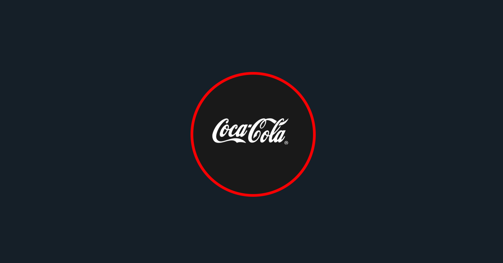
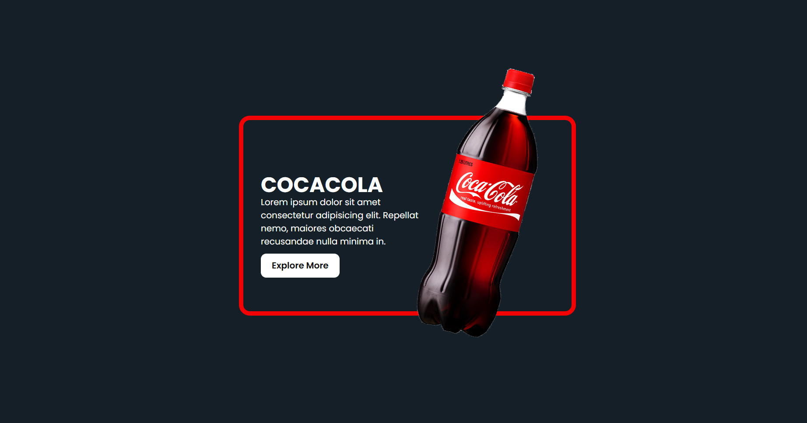

# Animated-CocaCola-Bottle Product Card

A responsive product card project featuring an animated Coca-Cola bottle, built using HTML and CSS.

# Description

This repository contains the code for a responsive product card featuring an animated Coca-Cola bottle. The project uses HTML and CSS to create a visually appealing and interactive product card that can be used in e-commerce websites, online marketplaces, or other digital platforms.

# Tutorial is available on youtube channel 
click on the link to see :- ([Open in Youtube](https://youtu.be/FhQkJ65YJDY))

# Screenshot
Here we have project screenshot :

# Features

Responsive design that adapts to different screen sizes and devices
Animated Coca-Cola bottle that adds a touch of interactivity to the product card
Customizable CSS styles to fit your brand's identity
Easy to integrate into existing websites or platforms
Getting Started

# Clone the repository and open the index.html file in a web browser
Customize the CSS styles to fit your brand's identity
Integrate the product card into your existing website or platform

# License

This repository is licensed under the MIT License. See the LICENSE file for details.

# Contributions

Contributions are welcome! Please open an issue or submit a pull request if you have any suggestions or improvements.

# Acknowledgements

The developers of the CSS styles and animations used in this project

# FAQs

Can I use this for any product?
Yes, you can customize the product card to fit any product by changing the image, text, and styles.
How do I customize the animation?
You can customize the animation by modifying the CSS styles and animation properties.
